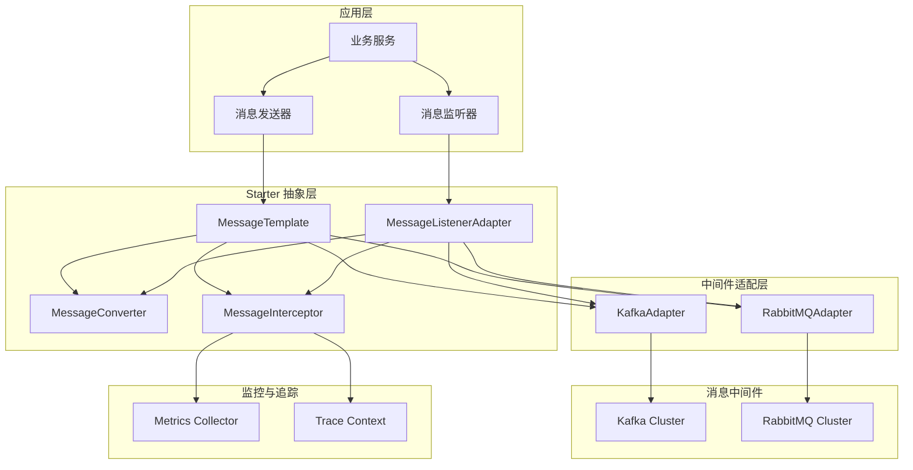
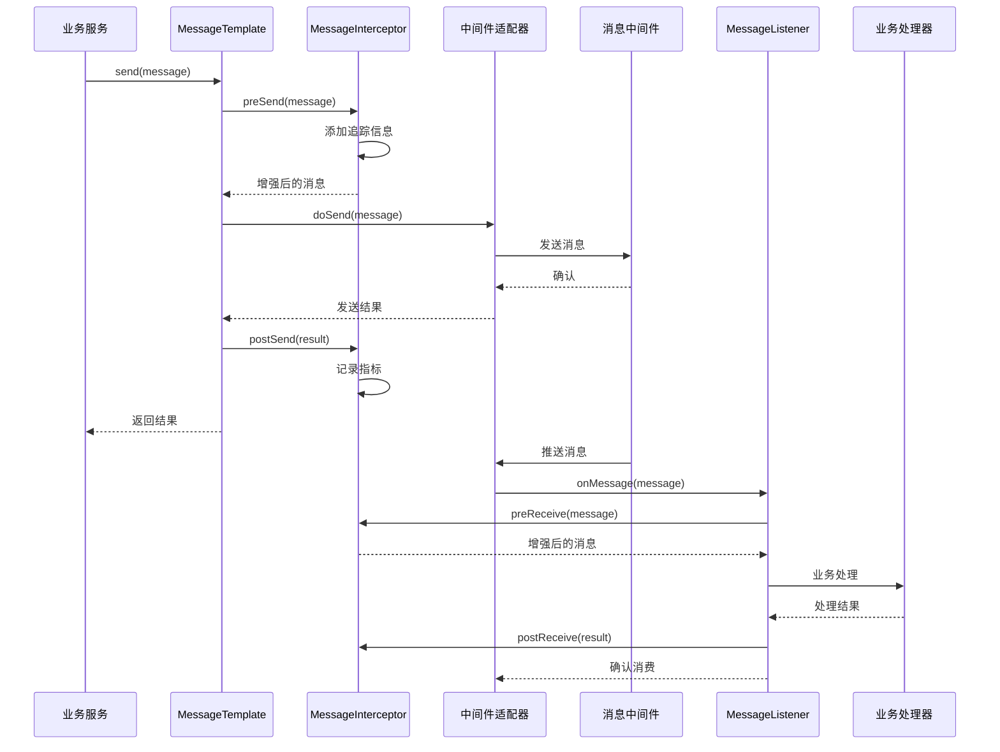

# 设计文档：异步消息驱动 Starter

## 概述

异步消息驱动 Starter（async-messaging-starter）是 EasyWing 平台的消息中间件集成模块，为 Spring Boot 微服务提供统一的消息发送和接收能力。该 Starter 支持多种消息中间件（Kafka、RabbitMQ），通过抽象层实现服务间的解耦和异步处理，简化消息驱动架构的开发复杂度。

核心特性包括：统一的消息抽象接口、多消息中间件支持、自动配置、消息序列化/反序列化、错误处理与重试、消息追踪与监控、事务消息支持。

## 架构设计

### 整体架构



### 消息流程序列图



## 组件和接口设计

### 核心接口

#### 1. MessageTemplate - 消息发送模板

```java
package com.easywing.platform.messaging.core;

import java.util.concurrent.CompletableFuture;

/**
 * 消息发送模板接口
 * 提供统一的消息发送能力，支持同步和异步发送
 */
public interface MessageTemplate {
    
    /**
     * 同步发送消息
     * 
     * @param destination 目标（主题/队列）
     * @param message 消息内容
     * @return 发送结果
     * @throws MessagingException 发送失败时抛出
     */
    <T> SendResult send(String destination, T message) throws MessagingException;
    
    /**
     * 同步发送消息（带分区键）
     * 
     * @param destination 目标
     * @param key 分区键
     * @param message 消息内容
     * @return 发送结果
     */
    <T> SendResult send(String destination, String key, T message) throws MessagingException;
    
    /**
     * 异步发送消息
     * 
     * @param destination 目标
     * @param message 消息内容
     * @return 异步发送结果
     */
    <T> CompletableFuture<SendResult> sendAsync(String destination, T message);
    
    /**
     * 异步发送消息（带回调）
     * 
     * @param destination 目标
     * @param message 消息内容
     * @param callback 发送回调
     */
    <T> void sendAsync(String destination, T message, SendCallback callback);
    
    /**
     * 发送事务消息
     * 
     * @param destination 目标
     * @param message 消息内容
     * @param transactionExecutor 事务执行器
     * @return 发送结果
     */
    <T> SendResult sendInTransaction(String destination, T message, 
                                     TransactionExecutor transactionExecutor) throws MessagingException;
}
```

#### 2. MessageListener - 消息监听器接口

```java
package com.easywing.platform.messaging.core;

/**
 * 消息监听器接口
 * 
 * @param <T> 消息类型
 */
@FunctionalInterface
public interface MessageListener<T> {
    
    /**
     * 处理接收到的消息
     * 
     * @param message 消息内容
     * @param context 消息上下文
     * @throws Exception 处理失败时抛出
     */
    void onMessage(T message, MessageContext context) throws Exception;
}
```

#### 3. MessageConverter - 消息转换器

```java
package com.easywing.platform.messaging.converter;

/**
 * 消息转换器接口
 * 负责消息的序列化和反序列化
 */
public interface MessageConverter {
    
    /**
     * 将对象转换为字节数组
     * 
     * @param object 待转换对象
     * @return 字节数组
     */
    byte[] toBytes(Object object) throws ConversionException;
    
    /**
     * 将字节数组转换为对象
     * 
     * @param bytes 字节数组
     * @param targetType 目标类型
     * @return 转换后的对象
     */
    <T> T fromBytes(byte[] bytes, Class<T> targetType) throws ConversionException;
    
    /**
     * 判断是否支持该类型
     * 
     * @param type 类型
     * @return 是否支持
     */
    boolean supports(Class<?> type);
}
```

#### 4. MessageInterceptor - 消息拦截器

```java
package com.easywing.platform.messaging.interceptor;

/**
 * 消息拦截器接口
 * 用于在消息发送和接收前后执行自定义逻辑
 */
public interface MessageInterceptor {
    
    /**
     * 发送前拦截
     * 
     * @param message 原始消息
     * @return 处理后的消息
     */
    Message<?> preSend(Message<?> message);
    
    /**
     * 发送后拦截
     * 
     * @param message 消息
     * @param result 发送结果
     */
    void postSend(Message<?> message, SendResult result);
    
    /**
     * 接收前拦截
     * 
     * @param message 接收到的消息
     * @return 处理后的消息
     */
    Message<?> preReceive(Message<?> message);
    
    /**
     * 接收后拦截
     * 
     * @param message 消息
     * @param result 处理结果
     */
    void postReceive(Message<?> message, Object result);
    
    /**
     * 拦截器顺序
     * 
     * @return 顺序值，越小越先执行
     */
    default int getOrder() {
        return 0;
    }
}
```

#### 5. MessagingAdapter - 中间件适配器接口

```java
package com.easywing.platform.messaging.adapter;

/**
 * 消息中间件适配器接口
 * 定义与具体消息中间件交互的标准方法
 */
public interface MessagingAdapter {
    
    /**
     * 发送消息
     * 
     * @param destination 目标
     * @param message 消息
     * @return 发送结果
     */
    SendResult doSend(String destination, Message<?> message) throws MessagingException;
    
    /**
     * 异步发送消息
     * 
     * @param destination 目标
     * @param message 消息
     * @param callback 回调
     */
    void doSendAsync(String destination, Message<?> message, SendCallback callback);
    
    /**
     * 注册消息监听器
     * 
     * @param destination 目标
     * @param listener 监听器
     */
    void registerListener(String destination, MessageListener<?> listener);
    
    /**
     * 获取适配器类型
     * 
     * @return 适配器类型（kafka, rabbitmq等）
     */
    String getAdapterType();
}
```

### 核心实现类

#### 1. AbstractMessageTemplate - 抽象消息模板

```java
package com.easywing.platform.messaging.core.impl;

/**
 * 抽象消息模板实现
 * 提供通用的消息发送逻辑和拦截器链处理
 */
public abstract class AbstractMessageTemplate implements MessageTemplate {
    
    protected final MessagingAdapter adapter;
    protected final MessageConverter converter;
    protected final List<MessageInterceptor> interceptors;
    protected final MessagingProperties properties;
    
    public AbstractMessageTemplate(MessagingAdapter adapter,
                                   MessageConverter converter,
                                   List<MessageInterceptor> interceptors,
                                   MessagingProperties properties) {
        this.adapter = adapter;
        this.converter = converter;
        this.interceptors = sortInterceptors(interceptors);
        this.properties = properties;
    }
    
    @Override
    public <T> SendResult send(String destination, T message) throws MessagingException {
        Message<?> wrappedMessage = wrapMessage(message);
        wrappedMessage = applyPreSendInterceptors(wrappedMessage);
        
        try {
            SendResult result = adapter.doSend(destination, wrappedMessage);
            applyPostSendInterceptors(wrappedMessage, result);
            return result;
        } catch (Exception e) {
            throw new MessagingException("Failed to send message", e);
        }
    }
    
    protected abstract Message<?> wrapMessage(Object payload);
    
    protected Message<?> applyPreSendInterceptors(Message<?> message) {
        Message<?> current = message;
        for (MessageInterceptor interceptor : interceptors) {
            current = interceptor.preSend(current);
        }
        return current;
    }
    
    protected void applyPostSendInterceptors(Message<?> message, SendResult result) {
        for (MessageInterceptor interceptor : interceptors) {
            interceptor.postSend(message, result);
        }
    }
}
```

#### 2. KafkaMessagingAdapter - Kafka 适配器

```java
package com.easywing.platform.messaging.adapter.kafka;

/**
 * Kafka 消息中间件适配器
 */
public class KafkaMessagingAdapter implements MessagingAdapter {
    
    private final KafkaTemplate<String, byte[]> kafkaTemplate;
    private final MessageConverter converter;
    private final Map<String, MessageListener<?>> listeners;
    
    public KafkaMessagingAdapter(KafkaTemplate<String, byte[]> kafkaTemplate,
                                 MessageConverter converter) {
        this.kafkaTemplate = kafkaTemplate;
        this.converter = converter;
        this.listeners = new ConcurrentHashMap<>();
    }
    
    @Override
    public SendResult doSend(String destination, Message<?> message) throws MessagingException {
        try {
            byte[] payload = converter.toBytes(message.getPayload());
            ProducerRecord<String, byte[]> record = createProducerRecord(destination, message, payload);
            
            org.springframework.kafka.support.SendResult<String, byte[]> result = 
                kafkaTemplate.send(record).get();
            
            return convertToSendResult(result);
        } catch (Exception e) {
            throw new MessagingException("Kafka send failed", e);
        }
    }
    
    @Override
    public void doSendAsync(String destination, Message<?> message, SendCallback callback) {
        try {
            byte[] payload = converter.toBytes(message.getPayload());
            ProducerRecord<String, byte[]> record = createProducerRecord(destination, message, payload);
            
            kafkaTemplate.send(record).addCallback(
                result -> callback.onSuccess(convertToSendResult(result)),
                ex -> callback.onFailure(new MessagingException("Kafka async send failed", ex))
            );
        } catch (Exception e) {
            callback.onFailure(new MessagingException("Failed to prepare message", e));
        }
    }
    
    @Override
    public String getAdapterType() {
        return "kafka";
    }
    
    private ProducerRecord<String, byte[]> createProducerRecord(String topic, 
                                                                 Message<?> message, 
                                                                 byte[] payload) {
        String key = message.getHeaders().get("messageKey", String.class);
        Integer partition = message.getHeaders().get("partition", Integer.class);
        
        ProducerRecord<String, byte[]> record = new ProducerRecord<>(topic, partition, key, payload);
        
        // 添加消息头
        message.getHeaders().forEach((k, v) -> {
            if (v != null) {
                record.headers().add(k, String.valueOf(v).getBytes());
            }
        });
        
        return record;
    }
}
```

#### 3. RabbitMQMessagingAdapter - RabbitMQ 适配器

```java
package com.easywing.platform.messaging.adapter.rabbitmq;

/**
 * RabbitMQ 消息中间件适配器
 */
public class RabbitMQMessagingAdapter implements MessagingAdapter {
    
    private final RabbitTemplate rabbitTemplate;
    private final MessageConverter converter;
    private final Map<String, MessageListener<?>> listeners;
    
    public RabbitMQMessagingAdapter(RabbitTemplate rabbitTemplate,
                                    MessageConverter converter) {
        this.rabbitTemplate = rabbitTemplate;
        this.converter = converter;
        this.listeners = new ConcurrentHashMap<>();
    }
    
    @Override
    public SendResult doSend(String destination, Message<?> message) throws MessagingException {
        try {
            byte[] payload = converter.toBytes(message.getPayload());
            
            // 解析 destination: exchange/routingKey
            String[] parts = parseDestination(destination);
            String exchange = parts[0];
            String routingKey = parts[1];
            
            org.springframework.amqp.core.Message amqpMessage = createAmqpMessage(message, payload);
            
            rabbitTemplate.send(exchange, routingKey, amqpMessage);
            
            return SendResult.success(destination, message.getHeaders().getId());
        } catch (Exception e) {
            throw new MessagingException("RabbitMQ send failed", e);
        }
    }
    
    @Override
    public void doSendAsync(String destination, Message<?> message, SendCallback callback) {
        // RabbitMQ 默认是异步的，使用 CorrelationData 实现回调
        try {
            byte[] payload = converter.toBytes(message.getPayload());
            String[] parts = parseDestination(destination);
            String exchange = parts[0];
            String routingKey = parts[1];
            
            org.springframework.amqp.core.Message amqpMessage = createAmqpMessage(message, payload);
            
            CorrelationData correlationData = new CorrelationData(message.getHeaders().getId());
            correlationData.getFuture().addCallback(
                result -> {
                    if (result != null && result.isAck()) {
                        callback.onSuccess(SendResult.success(destination, message.getHeaders().getId()));
                    } else {
                        callback.onFailure(new MessagingException("Message not acknowledged"));
                    }
                },
                ex -> callback.onFailure(new MessagingException("RabbitMQ async send failed", ex))
            );
            
            rabbitTemplate.send(exchange, routingKey, amqpMessage, correlationData);
        } catch (Exception e) {
            callback.onFailure(new MessagingException("Failed to prepare message", e));
        }
    }
    
    @Override
    public String getAdapterType() {
        return "rabbitmq";
    }
    
    private String[] parseDestination(String destination) {
        // 格式: "exchange/routingKey" 或 "queueName"
        if (destination.contains("/")) {
            return destination.split("/", 2);
        }
        return new String[]{"", destination}; // 默认 exchange
    }
}
```
